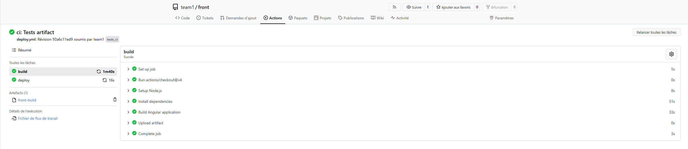

# Jobs et artifacts

## Besoin
Dans la première étape, nous avons utilisé le fichier fichier *deploy.yml* pour automatiser l'étape de build dans le job "deploy".

On souhaite maintenant séparer le build et le déploiement en deux jobs distincts pour plus de cohérence.

## Etapes à ajouter à deploy.yml
### Job build
Ajouter un job nommé **build**. Celui-ci comprendra les étapes de build ajoutées précédemment ainsi que l'action checkout permettant de récupérer le code.

Le job deploy conservera les steps de déploiement.

### Artifact
Le fait de séparer les steps en plusieurs jobs implique de gérer un **artifact**.

Ici il s'agit des fichiers générés par le job Build, puisqu'on souhaite les utiliser dans le job deploy.

On utilisera pour cela les actions :
- upload-artifact (la v4)
- download-artifact (la v4)

*Se rendre sur la page github des deux actions pour plus d'infos sur leur utilisation*

### upload-artifact et download-artifact
L'action **upload-artifact** va nous permettre d'uploader nos fichiers sous forme d'archive directement sur gitea (qui est capable de gérer ce genre de demande), pour que le job déploy puisse le récupérer par la suite grâce à l'action **download-artifact**

### Résultat attendu
On attend deux choses :
- Le workflow comprend maintenant deux jobs distincts : build et deploy
- L'artifact correspondant aux fichiers du build du front apparaît dans la liste des artifacts (front-build sur l'image)

